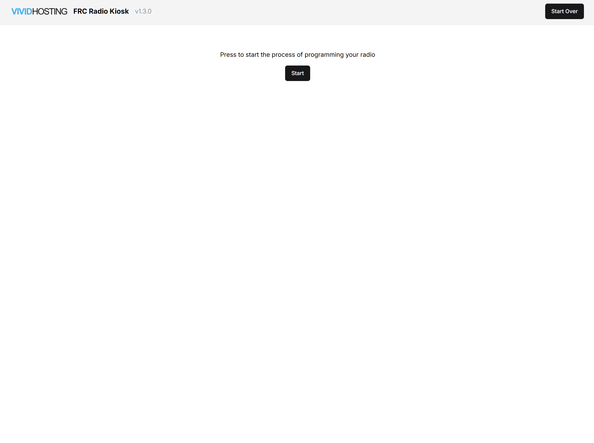
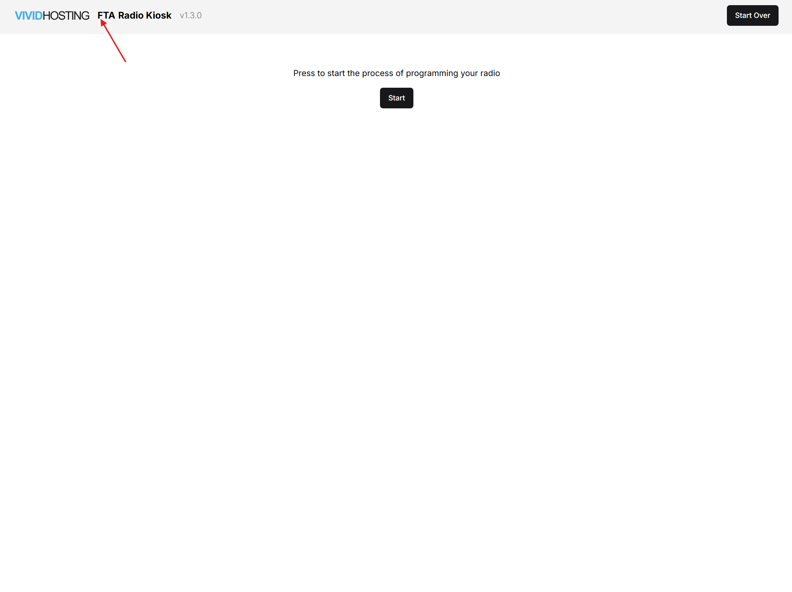
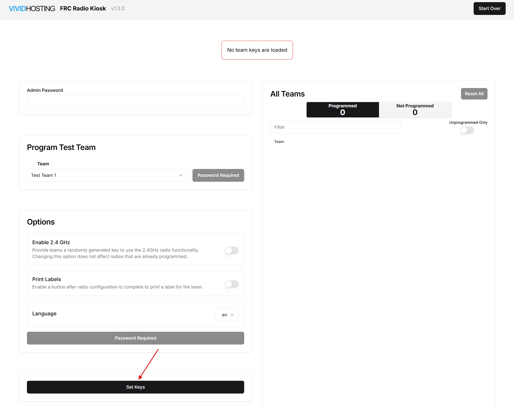
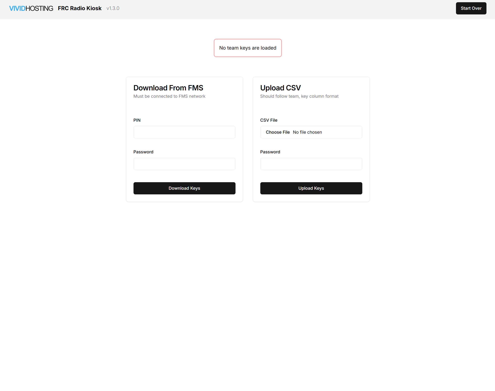
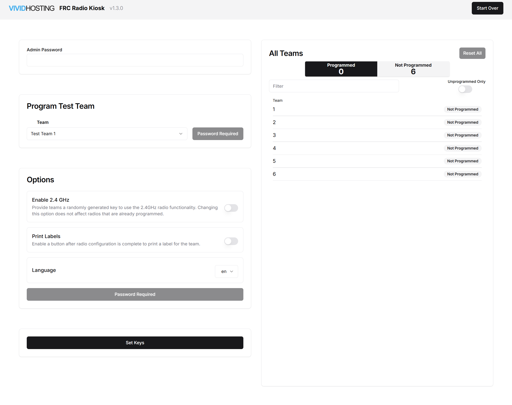

.. _wpa-kiosk-setup:

WPA Kiosk
======================

Navigation and use of the Vivid Hosting WPA Kiosk Programmer

Opening View
------------

Once the Docker container is started, the Kiosk interface can be accessed in a web browser at :code:`localhost`

All navigation is done within the web browser.

Access FTA Mode
---------------------------------------

FTA Mode is used to configure the kiosk for an event.

Hover over the F in ”FRC” on top right until FTA pops up, then click the F.

Load keys using Download From FMS
---------------------------------------

The preferred way to load an event and keys into the Kiosk is via "Download From FMS". Attach the machine running the kiosk program to the FMS network to use this option.

Enter the PIN number of the event currently active in FMS and the FTA password, Select the "Download Keys" button.

Note: At an off-season event, use the PIN "0000".

Load keys using Upload CSV
----------------------------------------

As an alternative, instead of Download From FMS, they WPA keys can be uploaded manually using a key file from FMS.  There is no effect on the operation of the kiosk software for using Download From FMS or Upload CSV. All result in the same team-facing experience.

.. image:: images/wpa-kiosk-4.png

Select the key file generated by FMS from a USB drive used to transfer the file, but do not copy the file onto the machine. The contents will be loaded into memory, but storing the key file itself on the computer leaves the keys vulnerable.

After selecting the file, enter the FTA passowrd and click "Upload Keys" to move the data into the kiosk program. Without clicking this button, no data will be loaded into the kiosk.

Additional Settings and Features in FTA Mode
---------------------------------------------

A list of radios that have been programmed/not programmed is displayed (no authentication is required for this feature)

Program radio with a Test Team

Allow 2.4GHz

Enable Print Label.

Change Kiosk Language.

Select "Start Over" in the upper right corner to begin to program team radios. If the Kiosk was attached to the FMS network to use Download Keys From FMS, it should be removed and placed in a location accessible for those needing to use it.

